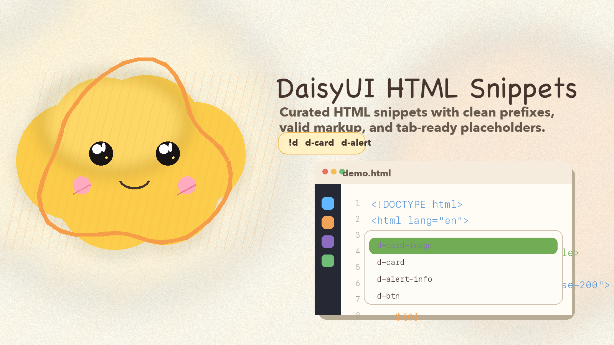
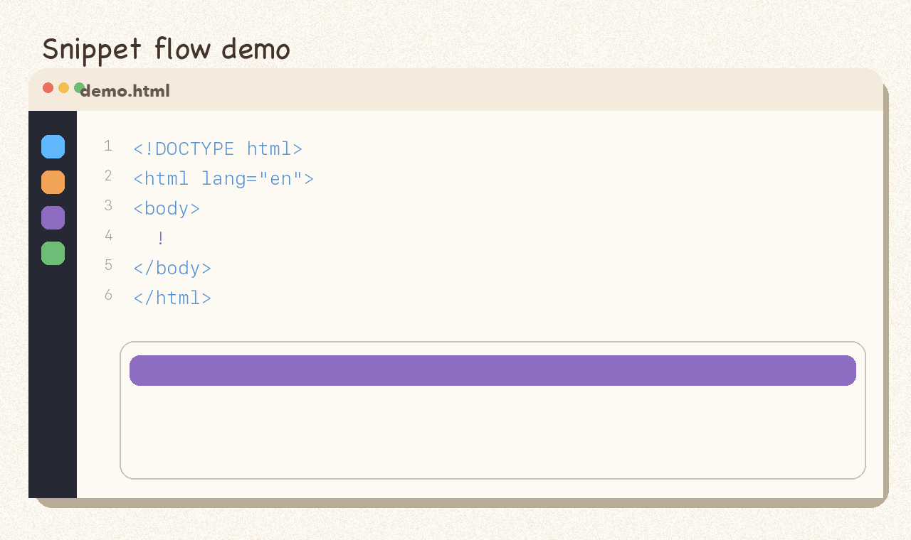
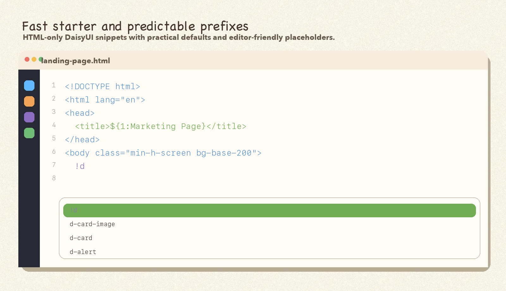
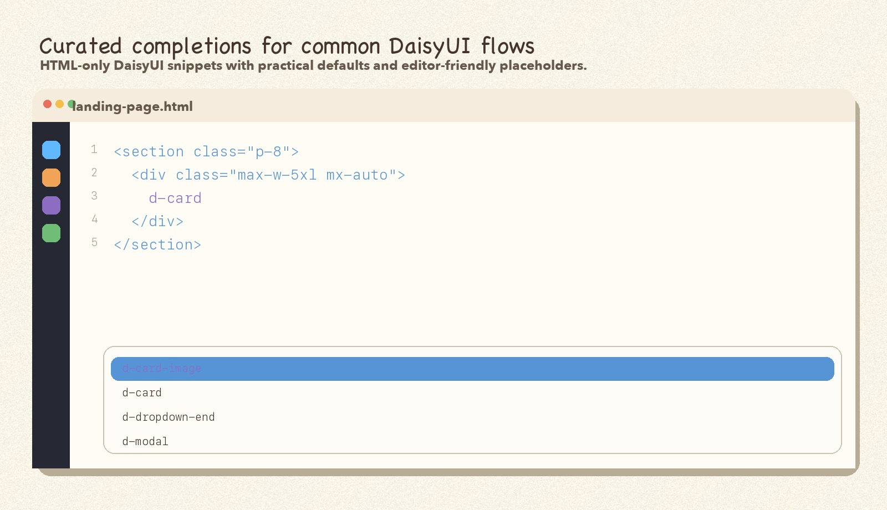

# DaisyUI Snippets for VS Code

Curated DaisyUI HTML snippets for Visual Studio Code with predictable prefixes, valid markup, and editable placeholders.

This extension now has a clear workflow:

- insert snippets and presets fast
- preview before committing
- refine page structure with themes and section patterns
- upgrade existing HTML into DaisyUI-friendly markup



## Visual Preview







## What Changed in `1.0.1`

- Added fixture-based regression tests for button, form control, card-wrap, and theme-switch upgrade flows.
- Added state-logic coverage for favorites, recents, picker ordering, and completion sort ranking.
- Added a packaged `.vsix` smoke check so release verification now confirms runtime files are actually shipped.

## What Changed in `1.0.0`

- Stabilized the extension around an HTML-first DaisyUI workflow: insert, preview, refine, and upgrade.
- Added automated coverage for the core HTML upgrade helpers.
- Tightened the release gate so validation and helper tests run before packaging.

## What Changed in `0.9.0`

- Added `DaisyUI: Upgrade Selected HTML` for transforming existing markup instead of only inserting new snippets.
- Added in-place upgrades for buttons, inputs, textareas, selects, tables, and generic content blocks.
- Moved the extension one step closer to acting like a real HTML assistant rather than a snippet picker.

## What Changed in `0.8.0`

- Added `DaisyUI: Preview Preset` so full-page scaffolds can be reviewed before insertion.
- Added `DaisyUI: Switch Theme in Document` for fast retheming of the active HTML file.
- Added `DaisyUI: Insert Section Pattern` with reusable hero, grid, stat, and CTA sections.

## What Changed in `0.7.0`

- Added themed document starters like `!d-dark` and `!d-corporate`.
- Added `DaisyUI: Insert Preset` for landing, dashboard, and auth page scaffolds.
- Pushed the extension beyond individual components into one-command page composition.

## What Changed in `0.6.0`

- Added recent snippet memory so the extension surfaces what you actually use most.
- Added favorites with command-palette access and preview-panel toggling.
- Ranked favorites and recents ahead of the broader catalog in completions and snippet pickers.

## What Changed in `0.5.0`

- Added `DaisyUI: Preview Snippet`, a rendered preview panel for checking a snippet before inserting it.
- Added insert and copy-prefix actions directly inside the preview panel.
- Pushed the extension beyond completion quality into a more product-like preview workflow.

## What Changed in `0.4.0`

- Replaced passive static snippet suggestions with an HTML completion provider driven by the generated catalog.
- Added richer completion labels, snippet previews, and starter/common/advanced ranking in the suggestion list.
- Reduced duplicate suggestion noise while keeping the command-palette flows from `0.3.0`.

## What Changed in `0.3.0`

- Added `DaisyUI: Insert Snippet`, a command-palette flow for searching snippets by component, variant, prefix, or description.
- Added `DaisyUI: Browse Snippets by Category` to jump into layout, forms, feedback, navigation, data, and actions faster.
- Upgraded the extension from a static snippet pack to a more discoverable command-driven workflow.

## What Changed in `0.2.4`

- Refreshed the Marketplace visuals with a colored-pencil mascot icon, banner, updated screenshots, and a short demo GIF.
- Added a reproducible asset generation script so the listing visuals can evolve without one-off editing.

## What Changed in `0.2.3`

- Changed the Marketplace display name to `DaisyUI HTML Snippets` to avoid a naming conflict during publish.

## What Changed in `0.2.2`

- Added a tag-driven GitHub release workflow that packages and attaches the `.vsix` artifact automatically.
- Added explicit Marketplace publishing commands and a local pre-publish gate.
- Tightened the release runbook so GitHub release and Marketplace publish steps are repeatable.

## What Changed in `0.2.1`

- Added GitHub Actions CI to generate, validate, and package the extension on every push and pull request.
- Added `.npmignore` so npm tarballs stay focused on release-facing files instead of repo internals.
- Added a `release:check` script for the full local release gate.

## What Changed in `0.2.0`

- Promoted a second wave of common components into curated multi-variant snippets.
- Added stronger variants for accordion, avatar, checkbox, footer, hero, menu, select, tabs, toast, and toggle.
- Improved library-wide UX consistency without reintroducing noisy snippet sprawl.

## What Changed in `0.1.1`

- Added `!d`, an HTML starter snippet that includes the current DaisyUI and Tailwind browser CDN setup.

## What Changed in `0.1.0`

- Rebuilt the library around a generated snippet catalog.
- Replaced brittle documentation-paste snippets with valid HTML templates.
- Standardized the prefix system with faster, more predictable names.
- Added placeholders and final cursor stops across the full shipped library.
- Narrowed the product promise to HTML users only for a cleaner v1 surface.

## Snippet UX

The extension now ships with:

- A golden set of hand-tuned snippets for the most-used components such as alerts, badges, buttons, cards, dropdowns, inputs, modals, navbars, tables, and textareas.
- One curated default snippet for every remaining DaisyUI component family so coverage stays broad without shipping hundreds of noisy variants.
- Predictable prefixes such as `d-alert`, `d-card`, `d-dropdown`, `d-navbar`, `d-table`, and `d-textarea`.
- Helpful aliases where they are natural, such as `d-btn` for the button snippet.

Every snippet is designed for plain HTML workflows:

- valid markup
- practical DaisyUI classes
- editable placeholders
- a useful final cursor position

## Core Workflow

The product promise for `1.0.0` is simple:

1. Insert components or full-page presets.
2. Preview snippets and presets before insertion.
3. Refine the page with themes and section patterns.
4. Upgrade existing HTML into DaisyUI-friendly structures.

The quality promise for `1.0.1` adds:

- fixture-based upgrade regression tests
- state-logic coverage for snippet ranking and picker ordering
- packaged artifact smoke checks before release

## Command Palette Workflow

This release adds two faster discovery flows on top of normal snippet prefixes:

- `DaisyUI: Insert Snippet`
- `DaisyUI: Browse Snippets by Category`
- `DaisyUI: Preview Snippet`
- `DaisyUI: Insert Recent Snippet`
- `DaisyUI: Insert Favorite Snippet`
- `DaisyUI: Toggle Favorite Snippet`
- `DaisyUI: Insert Preset`
- `DaisyUI: Preview Preset`
- `DaisyUI: Switch Theme in Document`
- `DaisyUI: Insert Section Pattern`
- `DaisyUI: Upgrade Selected HTML`

Use them when you remember the kind of component you want, but not the exact prefix.

## In-Editor Completions

When you type `d-` or `!` inside an HTML file, the extension now provides:

- ranked suggestions for starter, common, and advanced snippets
- richer labels that show the component and variant
- inline documentation with prefix aliases and snippet preview markup

## Preview Before Insert

Run `DaisyUI: Preview Snippet` to:

- render the chosen snippet in a dedicated preview panel
- inspect the generated HTML beside the rendered output
- insert the snippet into the active editor only when it looks right

## Favorites and Recents

The extension now remembers snippet usage across sessions:

- recent snippets rise to the top after you insert or preview them
- favorites can be toggled from the command palette or directly inside the preview panel
- favorite and recent commands give you a much faster repeat workflow for daily use

## Theme Starters and Presets

The extension now includes higher-level building blocks:

- `!d` for the default starter
- `!d-dark` for a darker product/demo surface
- `!d-corporate` for a more structured product or internal-tool shell
- `DaisyUI: Insert Preset` for landing page, dashboard, and auth scaffolds

## Refine After Insert

The extension now helps refine pages after the first insert:

- preview full-page presets before inserting them
- switch the active document theme without hand-editing `data-theme`
- drop in reusable section patterns to evolve a rough page faster

## Upgrade Existing HTML

You can now select existing markup and run `DaisyUI: Upgrade Selected HTML` to:

- turn plain buttons into DaisyUI buttons
- upgrade form fields into DaisyUI form controls
- upgrade plain tables into DaisyUI tables
- wrap raw blocks in a card surface without rebuilding the content manually

## Example Prefixes

- `d-alert`
- `!d`
- `d-alert-info`
- `d-accordion-plus`
- `d-avatar-group`
- `d-badge-outline`
- `d-button` or `d-btn`
- `d-card-image`
- `d-checkbox-primary`
- `d-dropdown-end`
- `d-footer-centered`
- `d-hero-split`
- `d-input`
- `d-menu-horizontal`
- `d-modal`
- `d-navbar`
- `d-select-ghost`
- `d-table-zebra`
- `d-tabs-lifted`
- `d-textarea`
- `d-toast-success`
- `d-toggle-primary`

## Installation

Install from the VS Code Marketplace:

- [DaisyUI Snippets on the VS Code Marketplace](https://marketplace.visualstudio.com/items?itemName=sjedt.daisyui-vscode-snippets)

Or install the packaged release artifact:

1. Download `bin/daisyui-vscode-snippets.vsix` from the matching release commit or release page.
2. Open the Command Palette in VS Code.
3. Run `Extensions: Install from VSIX...`
4. Select the `.vsix` file.

## Development Workflow

The extension is now driven by a generated source catalog.

Source of truth:

- [`src/snippet-catalog.mjs`](./src/snippet-catalog.mjs)

Marketplace assets:

- [`scripts/generate-marketplace-assets.py`](./scripts/generate-marketplace-assets.py)
- [`images/banner.png`](./images/banner.png)
- [`images/icon.png`](./images/icon.png)
- [`images/screenshot.jpg`](./images/screenshot.jpg)
- [`images/screenshot-2.jpg`](./images/screenshot-2.jpg)
- [`images/demo.gif`](./images/demo.gif)

Generated output:

- [`snippets/snippets.json`](./snippets/snippets.json)

Core commands:

```bash
npm install
npm run generate
npm run assets:generate
npm run validate
npm run package:vsix
npm run release:check
npm run publish:precheck
```

## Release Checklist

Use this flow before a Marketplace publish or release tag:

1. Run `npm run release:check`.
2. Install `bin/daisyui-vscode-snippets.vsix` locally with:
   `code --install-extension bin/daisyui-vscode-snippets.vsix --force`
3. Confirm the installed version matches `package.json`.
4. Smoke-test key prefixes in an HTML file:
   - `!d`
   - `d-alert`
   - `d-btn`
   - `d-card-image`
   - `d-dropdown`
   - `d-modal`
   - `d-navbar`
   - `d-table-zebra`
5. Update the changelog and release notes.
6. Tag from `main` after the PR is merged.

## Publishing

Local Marketplace publish flow:

```bash
npm run publish:precheck
npx @vscode/vsce login sjedt
npm run publish:vsce
```

GitHub release flow:

1. Merge the release branch into `main`.
2. Create and push a tag such as `v0.2.2`.
3. Let the `Release` GitHub Actions workflow build and attach `bin/daisyui-vscode-snippets.vsix`.

Example:

```bash
git checkout main
git pull --ff-only
git tag v0.2.2
git push origin v0.2.2
```

## Git and Release Cycle

Recommended workflow for each improvement cycle:

1. Create a feature branch from `main`, for example `codex/phase-1-foundation`.
2. Make small, focused commits with conventional commit prefixes.
3. Open a PR with:
   - objective
   - what changed
   - how to test
   - release impact
4. Squash merge into `main`.
5. For strong user-facing milestones:
   - bump the version
   - update Markdown docs
   - build `bin/daisyui-vscode-snippets.vsix`
   - tag the release

The full roadmap lives in [`improvement_plan.md`](./improvement_plan.md).
The release operations playbook lives in [`RELEASING.md`](./RELEASING.md).

## Scope

This extension intentionally focuses on:

- HTML users
- DaisyUI component scaffolding
- curated static snippets

It does not currently target:

- JavaScript framework-specific markup
- MCP integration
- LSP-based diagnostics

## License

Released under the Apache License, Version 2.0.
